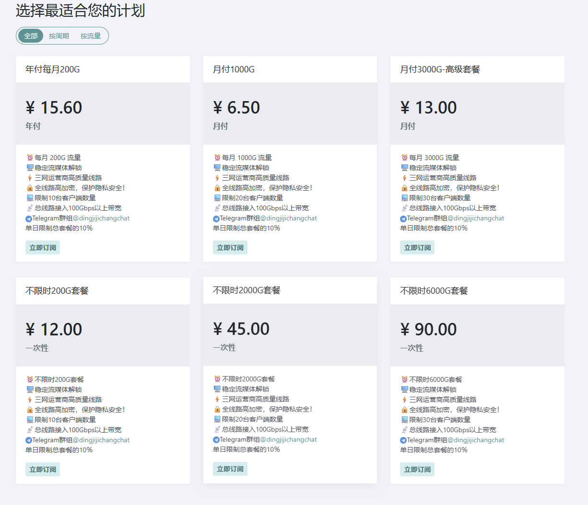

自用机场笔记，不是超市，需要的可阅读和收藏，不懂请绕路。
*整理分享不易，伙伴儿们，请走我的邀请码~*

# 性价比机场推荐【不定期更新】

踩过那么多坑，整理自己自用的一些资源：
希望有需求的伙伴，都能找到合适的机场登陆。少走弯路，就是省时间省钱！

## 顶级机场（建议备用）

一款性价比非常高的魔法工具，稳定性稍差一些，搭搭梯子，完全没有问题。windows、mac、android、linux都能支持，多端使用不限制客户端数量。如果有复杂任务，比如使用AI Agent做复杂任务（编程、批量任务、写长篇小说等），就得选择更稳定的机场了。

**官网地址**

[顶级机场官网](https://xn--mes358a9urctx.com/#/register?code=B4DGFkK9)

注册别忘了邀请码，[B4DGFkK9](https://xn--mes358a9urctx.com/#/register?code=B4DGFkK9)，享8.5折充值优惠，以官方活动为准。

**核心优势：**

价格门槛低，支持流量大，套餐丰富。

**可选套餐**

有包月、包年和流量套餐可选，最诱人的是这个**每月200G的15元年包**，流量肯定是够的，慢点卡点是不是也能忍了^_^。做为备用机场，可以闭着眼睛选了。

## NiceCloud（经济稳定）

2026 非常受欢迎的机场推荐---奈丝云 [NiceCloud](https://nicecloud.cyou/register?aff=lBM0BUEN)，包含众多稳定高速冷门机场节点。油管、飞机、脸书你想去哪里？都可以~

AI玩家的性价比之选：Claude的逻辑能力、GPT的世界知识、Gemini的长文本处理、Midjourney的绘图审美……这些“生产力怪兽”都可以拥有。印度、德国和土耳其节点超级稳定~

**NiceCloud简介**

NiceCloud 耐思云，稳定好用便宜的优质SS/SSR机场，也是入口数量极多的大带宽高速机场梯子。目前，NiceCloud在全球超过38条优质线路，其节点涵盖美国，香港，台湾，日本，韩国，新加坡，马来西亚，泰国，德国，英国，荷兰，俄罗斯，土耳其，法国等，并根据使用偏好热门地区不断增加中。

完美支持ChatGPT与Tiktok、Netflix、Disney、HULU、HBO、TVB、动画疯等国外流媒体视频，能够很好地满足大多数场景的应用落地和用户需求，是性价比很高的翻墙梯子，也是近期机场推荐 和梯子推荐榜前三。

**官网地址**
[NiceCloud](https://nicecloud.cyou/register?aff=lBM0BUEN)

* [官网备用一](https://nicecloud.me/register?aff=lBM0BUEN)
* [官网备用二](https://nicecloud.co/register?aff=lBM0BUEN)
* [官网备用三](https://nicecloud.cyou/register?aff=lBM0BUEN)

注册别忘了邀请码，[lBM0BUEN](https://nicecloud.cyou/register?aff=lBM0BUEN)，享充值折扣，以官方活动为准。

**机场特点**
* 流量充足，定价偏低，属于便宜的机场梯子；
* 入口数量多，常用热门节点香港日本等均单独配置入口，稳定性高；
* 新晋稳定便宜机场梯子不存在老牌机场超卖问题，用户少不拥挤，带宽速度体验佳；
* 支持跨平台主流插件（Shadowrocket/Clash/Stash等本站软件下载页面）订阅链接，有详细教程；
* 全套餐都提供ChatGPT、TikTok、流媒体解锁；
* 所有节点全部真实1倍率，流量使用记录实时查询；
* 通过邀请注册即可免费试用24H，充分体验满意后再决定是否订阅；
* 支持支付宝、微信付款，方便快捷；
* 支持提交工单和TG在线客服，快速响应。

**可选套餐**

耐思云机场套餐定价灵活，从月付16.99元到43.99元（**[优惠码]NICECLOUD**），均可支持流媒体解锁，能够满足绝大部分的应用落地与不同的用户需求，更针对轻量翻墙用户提供永久有效流量包，属于极高性价比机场梯子。

## BitzNet（高性能之选）

bitznet是一个连续经营6年的老牌网络加速服务，也是大家熟知的稳定机场代表。覆盖全球 17 个国家与地区的 20 余个数据中心，包括香港，台湾，日本，韩国，新加坡，美国，英国，法国，德国，澳大利亚，菲律宾，土耳其，阿根廷，巴西，印度等。

BitzNet对下列国家和地区的所有线路支持流媒体解锁：美国、日本、台湾、香港、新加坡、英国。

**官网地址**

官网地址：[bitzconnect.com](https://enf.neobitz.net/#/register?code=6ZZ6gqQ2)

直连地址(最新备用)：[onbitz](https://enf.neobitz.net/#/register?code=6ZZ6gqQ2)

注册别忘了邀请码，[6ZZ6gqQ2](https://enf.neobitz.net/#/register?code=6ZZ6gqQ2)，享充值折扣，以官方活动为准。

如出现安全验证（如下图），这个是正常的人机安全检测，需要耐心等一会儿或者稍后打开。

> 如果网络连接不可用，大家可以选择上面的备用直连。

**核心优势**
* 广东/上海 IEPL 专线
* 含亚洲优化线路
* 最高800M 峰值带宽
* 最高1000 GB 流量
* 流媒体解锁
* 不限制本人设备数

**可选套餐**

bitznet套餐最低￥69.99/季，约合每月￥23.33/80G流量，年付更优惠。所有套餐均包含流媒体解锁、广东 IEPL 专线、不限制本人设备数以及在线客服售后保障，具体可参考下图表：

# 一些小知识

## 机场路线和协议

机场路线选择：IEPL > IPLC > 中转（含BGP） >直连

传输协议速度：Shadowsocks > Hysteria 2 > Hysteria > Trojan > Vless > Vmess。
- Shadowsocks基本上属于中转机场和专线机场专用协议

## 机场流量多少才够用？
对很多新手来说，选择机场套餐的时候都不知道该选择哪种流量的套餐，不知道自己能用多少，选少了不够用又需要单独再购买流量包，选多了剩下不少流量感觉又蛮浪费，所以润土这里给点选择流量的思路，方便参考：

**轻度科学上网者**，偶尔翻出来也仅仅是刷刷 X、Telegram 等，没有太多视频、图片浏览的需求，可以选择套餐流量 10GB-100GB 每月的机场套餐，或者干脆选择那种按量付费机场套餐。按量付费机场套餐指的是流量包不限制使用使用，比如 100G流量包，只要机场还在，流量没用完，机场的节点就可以一直用下去。  
**一般科学上网者**，既有访问 X 站刷推文，访问各种网页，也有看 Netflix、Youtube、Pornhub、TikTok 视频需求的，日常使用一般选择 100GB-300GB 每月的机场套餐，足够使用。这个主要看自己的使用频率，选择这个流量区间的套餐，一般都是机场的主打/旗舰套餐，提供的线路应该也是不错的。  
**重度科学上网者**，不仅会看 Netflix、Youtube、Pornhub、TikTok 各类视频，也会从海外网站缓存视频、文本内容到本地的，一般可能需要选择 300G、500G 甚至 TB 为单位的机场套餐。对于大流量需求，很多专线节点的流量十分金贵，可以使用一些公网隧道和专线混合网络的机场或者选择多持有几家机场套餐，主力选择稳定，备用选择便宜大碗的方案。

## 我该选择哪些机场节点？

个人使用请以实际体验为主，测速或线路名称都只是一个参考因素。不要迷信机场官方宣传的IPLC或IEPL专线，由于成本的原因机场的专线都是共享的，所以期待值不要太高。选择什么线路或节点并不重要，不管是专线还是AIA还是直连，只要稳定快速不怎么掉线，就是好线路。

**建议亲自购买套餐试用一段时间，再判断一个机场是否值得长期持有。同时，一定要有备用的梯子选项，这个十分重要。**

至于地区选择，网上建议优先选择香港、新加坡、台湾或日本节点，体验低延迟的服务。韩国节点并不是特别推荐，虽然当地节点延迟也低，但韩国节点也是有墙存在的体验会稍逊一筹。

流媒体解锁，香港、新加坡节点有不错的中文支持，Netflix、Disney+在这些节点下片源和字幕支持的体验佳。

美国、日本、新加坡节点都可以解锁 ChatGPT，指定好规则或者直接全局模式下使用即可。原生的香港节点一般不支持 ChatGPT，很多支持 ChatGPT 的香港节点是机场做了解锁处理的，ChatGPT 会识别该节点 IP 为美国、日本、台湾或新加坡等地区。

## 我该选择使用哪一款客户端？

**Windows** 电脑目前最推荐使用 Clash Verge （新版，也就是 Clash Verge Rev），界面美观，易用性高，支持中文，使用开源内核。
macOS 系统目前最推荐的也是 Clash Verge （新版），界面美观，易用性高，支持中文，使用开源内核。此外， ClashX Meta 也是 Mac 用户的不错选择，如果之前用的是 ClashX 的话，ClashX Meta 替代几乎无感，界面相似度很高，只是可选择多种面板和新协议的支持。

此外，Clash Nyanpasu 也是 PC 端的又一不错选择，支持 Windows 和 Mac。

**iOS** 系统建议新手使用 Shadowrocket ，俗称的小火箭，软件上手十分简单，导入订阅链接即可使用。Clash iOS 版本现已上架 App Store，名为 Stash，售价 $5.99 美元的付费软件，一键导入或下载 Clash 订阅链接使用。
喜欢折腾的也可以使用 Quantumult X ，俗称圈X，界面美观，功能比小火箭更加强大。但总体而言，小火箭可以完全满足需求，稳定性和速度方面和圈X区别已经不大了。另一新兴的 Loon 软件，是 Quantumult X 的强劲对手，功能超过 Quantumult X 价格还更便宜。

**安卓**系统可以使用 Clash Meta for Android。润土分享也推荐选择使用 Surfboard，俗称冲浪板，套用 Surge 的订阅格式。

• [Clash Verge 下载地址](https://github.com/clash-verge-rev/clash-verge-rev)

• [Shadowrocket 下载地址](https://apps.apple.com/us/app/shadowrocket/id932747118)

• [Surfboard 下载地址](https://manual.getsurfboard.com/)

# 温馨提示

- 机场站的域名常有遭遇污染的风险，需留意官方最新直连地址，建议关注项目更新。
- 使用网络产品要遵纪守法，不轻信没有验证过的服务。
- 本页面仅是信息分享，有问题请自行联系服务商处理。